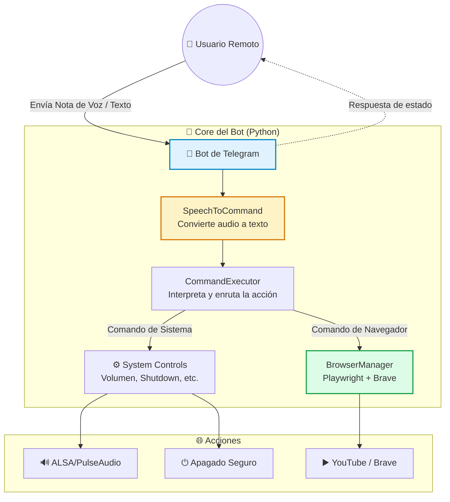

# 🤖 Linux Telegram Control

> **📌 Nota:** Bot de automatización y control remoto para sistemas Linux, diseñado originalmente para gestionar, supervisar y cambiar el contenido multimedia en tiempo real de forma segura y remota.

Una solución elegante que transforma tu teléfono en un control remoto universal para tu computadora Linux. A través de **Telegram**, el bot escucha notas de voz o comandos de texto, los interpreta y ejecuta acciones directas en el sistema operativo o en el navegador, permitiendo un control granular sin necesidad de acceso físico al equipo.

---

## 🚀 Características Principales

- 🎙️ **Control por Voz Nativo**: Convierte notas de voz de Telegram en comandos ejecutables mediante reconocimiento de voz (`SpeechRecognition` + `pydub`).
- 🌐 **Automatización de Navegador**: Controla **Brave Browser** para buscar y reproducir contenido en YouTube, con bloqueo de anuncios (Brave Shields) y anti-detección activados.
- 💻 **Control del Sistema**: Ajusta el volumen del sistema, avanza/retrocede contenido, activa pantalla completa o apaga el equipo de forma segura y controlada.
- 🐧 **Optimizado para Linux**: Diseñado para ejecutarse en entornos Linux, con soporte para modo *headless* (sin interfaz gráfica) mediante Docker o Xvfb.
- 🛡️ **Arquitectura Modular**: Separación clara de responsabilidades (Configuración, Navegador, Ejecutor de Comandos, Notificador) para facilitar el mantenimiento y la escalabilidad.

---

## 🏗️ Arquitectura del Sistema



---

## 📂 Estructura del Proyecto

La arquitectura sigue un patrón modular basado en controladores, lo que permite una fácil extensión de nuevos comandos o plataformas.

```text
.
├── controller/
│   ├── BrowserManager.py      # 🌐 Gestión de Brave con anti-detección y bloqueo de anuncios
│   ├── CommandExecutor.py     # ⚙️ Ejecución de comandos del sistema (volumen, apagado, etc.)
│   ├── Config.py              # 🔧 Carga y validación de variables de entorno (.env)
│   ├── Log.py                 # 📝 Sistema de logging thread-safe con rotación automática
│   ├── NotificadorTelegram.py # 📱 Lógica de envío/recepción de mensajes y gestión de la API
│   └── SpeechToCommand.py     # 🎙️ Conversión de audio a texto y mapeo a comandos registrados
├── main.py                    # Punto de entrada: inicialización del bot y registro de handlers
├── example                    # Plantilla de variables de entorno (.env)
├── requirements.txt           # Dependencias de Python
├── Dockerfile                 # Contenedor para despliegue headless en Linux
└── README.md                  # Este archivo
```

---

## 📋 Requisitos Previos

- **Python 3.10+**
- **FFmpeg** (necesario para `pydub` y el procesamiento de audio)
- **Navegador Brave** (o Chromium) instalado en el sistema
- **Cuenta de Bot de Telegram** y su `TELEGRAM_TOKEN` (obtenido vía @BotFather)
- **Chat ID** del usuario administrador

---

## 🛠️ Instalación y Configuración

### 1. Clonar y preparar el entorno
```bash
git clone https://github.com/MartinCiro/linux_telegram_control.git
cd linux_telegram_control

# Crear y activar entorno virtual
python3 -m venv venv
source venv/bin/activate  # En Windows: venv\Scripts\activate

# Instalar dependencias
pip install -r requirements.txt
```

### 2. Instalar navegadores de Playwright
```bash
playwright install chromium
# Opcional: instalar dependencias del sistema para Playwright
playwright install-deps chromium
```

### 3. Configurar variables de entorno
Copia el archivo de ejemplo y completa tus credenciales:
```bash
cp example .env
```
Edita el archivo `.env` con tu editor favorito:
```env
# 🔑 Telegram
TELEGRAM_TOKEN=tu_token_aqui
TELEGRAM_CHAT=tu_chat_id_aqui

# 🌐 Navegador (True = modo invisible, False = mostrar ventana)
HEADLESS=False

# 🎵 Configuración por defecto
DEFAULT_QUERY=lofi hip hop radio
```

### 4. Ejecutar el proyecto
```bash
python main.py
```
> El bot comenzará a escuchar. Envía una nota de voz diciendo *"reproduce lofi"* o *"sube volumen a 70"* para probar la funcionalidad.

---

## 🎙️ Comandos de Voz Soportados

El bot está diseñado para entender lenguaje natural. Puedes enviar una nota de voz diciendo:

| Intención | Ejemplos de Frases | Acción Ejecutada |
| :--- | :--- | :--- |
| **Saludo** | *"hola"*, *"saluda"* | Responde con un mensaje de bienvenida |
| **Reproducción** | *"reproduce lofi"*, *"pon música"* | Abre Brave y busca en YouTube |
| **Control** | *"siguiente"*, *"pausa"*, *"anterior"* | Controla la reproducción multimedia |
| **Volumen** | *"volumen 50"*, *"baja volumen"* | Ajusta el volumen del sistema (0-100) |
| **Visual** | *"pantalla completa"* | Maximiza el video en el navegador |
| **Sistema** | *"apaga el equipo"*, *"cierra todo"* | Cierra el navegador y programa el apagado |
| **Ayuda** | *"ayuda"*, *"qué puedes hacer"* | Muestra la lista de comandos disponibles |

---

## 🐳 Despliegue en Producción (Docker)

Para ejecutar el bot en un servidor Linux sin interfaz gráfica (headless), utiliza Docker:

```bash
# Construir la imagen
docker build -t telegram-control-bot .

# Ejecutar el contenedor (asegúrate de tener el archivo .env configurado)
docker run -d \
  --name tg-bot \
  --env-file .env \
  --shm-size=1gb \
  telegram-control-bot
```
*(Nota: Para controlar el volumen o apagar el host desde dentro del contenedor, podrías necesitar mapear el socket de PulseAudio/PipeWire o usar SSH, dependiendo de tu configuración de seguridad).*

---

## ⚠️ Consideraciones de Seguridad y Uso Responsable

1. **Acceso Privilegiado**: Este bot tiene la capacidad de ejecutar comandos en tu sistema. Mantén tu `TELEGRAM_TOKEN` y `TELEGRAM_CHAT` en secreto.
2. **Entorno de Confianza**: Fue diseñado para redes domésticas o entornos de confianza. No se recomienda exponer el equipo a comandos remotos sin las debidas restricciones de red.
3. **Apagado Seguro**: El comando de apagado cierra primero el navegador y espera 3 segundos para garantizar que el bot pueda enviar un mensaje de confirmación antes de que el sistema se detenga.

---

## 👤 Autor

**Martin Ciro**  
[](https://github.com/MartinCiro)

---
*Desarrollado con Python, Playwright y python-telegram-bot. Inspirado en la necesidad de control parental remoto y gestión eficiente de estaciones de trabajo Linux.*